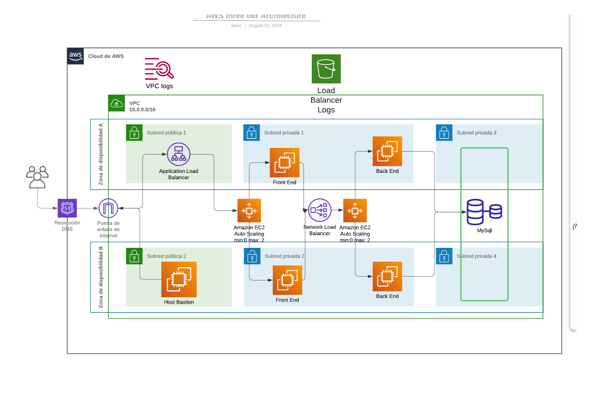

## README for AWS Three-Tier Architecture with Terraform

### Overview
This project sets up a three-tier architecture on AWS using Terraform modules. The architecture consists of a VPC with public and private subnets, an Application Load Balancer, EC2 instances in Auto Scaling groups for the front-end and back-end tiers, and an RDS MySQL database in private subnets. A VPN connection is configured to securely connect to the database from an external network.




### Prerequisites
- Terraform 1.6.0 or later
- AWS CLI configured with appropriate IAM permissions
- Access to a key pair for EC2 instance access
- An S3 bucket for storing Terraform state

### Architecture Components
1. **VPC**: A Virtual Private Cloud with a CIDR block of `10.0.0.0/16` containing both public and private subnets across two availability zones.
2. **Application Load Balancer (ALB)**: Distributes incoming traffic to the front-end EC2 instances.
3. **Network Load Balancer (NLB)**: Handles traffic between front-end and back-end services.
4. **EC2 Instances**:
   - **Front-End**: Hosts the front-end application, autoscaling from 0 to 2 instances.
   - **Back-End**: Hosts the back-end application, autoscaling from 0 to 2 instances.
5. **RDS MySQL Database**: Located in private subnets to store application data.
6. **VPN**: Configured to allow secure access to the RDS MySQL database from your local machine.
7. **Bastion Host**: Allows secure SSH access to the private EC2 instances.

### Terraform Modules
This project is structured using Terraform modules for better management and reusability.

- **VPC Module**: Creates the VPC, subnets, route tables, and necessary security groups.
- **EC2 Module**: Configures EC2 instances for both the front-end and back-end, including Auto Scaling Groups.
- **ALB Module**: Sets up the Application Load Balancer to manage incoming traffic.
- **NLB Module**: Configures the Network Load Balancer to handle traffic between front-end and back-end.
- **RDS Module**: Sets up the MySQL database in private subnets.
- **VPN Module**: Establishes a VPN connection to securely connect to the RDS database.

### Instructions
1. **Clone the Repository**:
   ```bash
   git clone <repository_url>
   cd <repository_name>
   ```

2. **Initialize Terraform**:
   ```bash
   terraform init
   ```

3. **Review and Edit Variables**:
   Adjust the variables in `terraform.tfvars` or the module's variable files according to your requirements.

4. **Apply Terraform Configuration**:
   ```bash
   terraform apply
   ```
   Confirm with `yes` when prompted.

5. **Connect to the RDS Database**:
   Use the VPN configuration to securely connect to the RDS MySQL instance from your local environment.

### VPN Configuration
To set up a secure VPN connection to your RDS database, follow these steps:

1. **Create a Client VPN Endpoint**:
   - Use AWS Management Console or Terraform to create a Client VPN endpoint.
   - Set the CIDR range to match the VPC's CIDR.
   - Associate the VPN endpoint with the appropriate VPC subnets.

2. **Download the Client VPN Configuration File**:
   - Download the configuration file from the AWS Console.
   - Import it into your preferred VPN client (e.g., AWS VPN Client, OpenVPN).

3. **Connect to the VPN**:
   - Start the VPN client and connect using your credentials and the configuration file.

### Cost Information
- **EC2 Instances**: Cost varies based on instance type and usage.
- **RDS MySQL**: Charges based on instance size, storage, and I/O.
- **Load Balancers (ALB & NLB)**: Billed per hour and data processed.
- **VPN**: Monthly fee for each client VPN endpoint association and data transfer costs.

> **Note**: Use the AWS Pricing Calculator to get an accurate estimate based on your specific configuration.

### DevOps System
To create a DevOps pipeline for continuous integration and continuous deployment (CI/CD), follow these steps:

1. **Source Code Management**:
   - Use GitHub, GitLab, or Bitbucket to host your code repository.

2. **CI/CD Pipeline**:
   - Use AWS CodePipeline or Jenkins to automate testing, build, and deployment.
   - Configure AWS CodeBuild or Jenkins to compile and test your application code.
   - Deploy infrastructure changes using Terraform scripts in the pipeline.

3. **Monitoring and Logging**:
   - Use AWS CloudWatch for monitoring the health and performance of the infrastructure.
   - Enable AWS CloudTrail for auditing and compliance.
   - Store logs in S3 or use third-party tools like ELK Stack for log analysis.

4. **Alerting**:
   - Set up alarms in CloudWatch to alert on predefined metrics (e.g., CPU usage, memory usage, RDS connections).

5. **Backup and Disaster Recovery**:
   - Configure automated backups for RDS instances.
   - Use AWS Backup or third-party solutions for EC2 instance backups.

### Conclusion
This Terraform project provides a robust, scalable three-tier architecture on AWS. By following these steps, you can deploy a secure, highly available web application and maintain it using a comprehensive DevOps strategy.

### Next Steps
- Implement security best practices (e.g., IAM roles, security groups).
- Optimize costs by right-sizing instances and using Reserved Instances or Savings Plans.
- Explore advanced AWS services like Lambda for serverless computing or API Gateway for RESTful API management.
